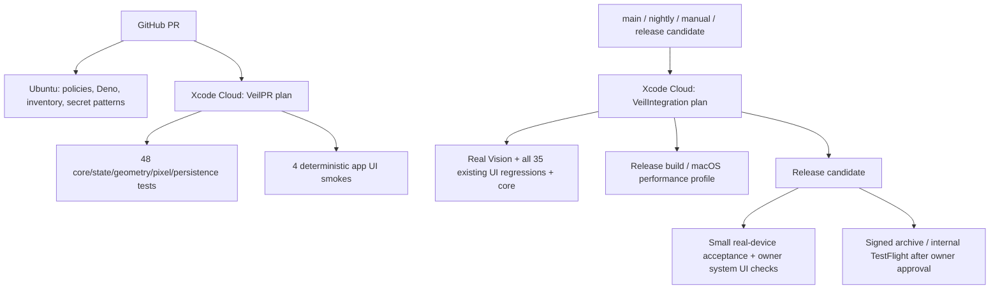

# Veil testing and release strategy

## Architecture

Until owner activates and requires Xcode Cloud, the same plans execute on GitHub's **macos-26 Apple Silicon** runner. `APPLE_CI_PROVIDER=xcode-cloud` disables that fallback only after a verified transition; backend/security checks stay on GitHub. No Apple test results are replaced by a no-op success.

## Coverage and boundaries

[TEST_MATRIX.md](TEST_MATRIX.md) and its machine-readable inventory assign every test a home. Baseline: 50 SwiftPM core methods (48 deterministic, two opt-in macOS Vision/performance profiles), 35 legacy UI methods. Added: four deterministic UI smokes, two native real-Vision integration tests, one physical-device acceptance method. No legacy test is removed, skipped or silently quarantined. `verify_execution.py` compares native executed identifiers to the inventory and requires every case to pass on every destination/configuration; zero-test, missing-test, skipped or expected-failure green runs are rejected by both runners.

PR: 52 tests. Integration: 85 iOS tests (48 core, two real Vision, all 35 legacy UI), plus the two macOS performance methods. Device: one focused real-Vision/composition/save/reopen flow. Integration repeats deterministic core protection deliberately; these counts overlap.

Only external analysis is substitutable: `PrivacyAnalyzing` returns the existing face/plate/document geometry and foreground mask. Production always uses `VisionPrivacyAnalyzer`. A DEBUG-only fixture analyzer requires **both** explicit test launch flags. The same selection/cache lifecycle, scoped Undo, effects, masks, shared renderer, asynchronous publication and persistence execute afterward. Small PR fixture input is 600 pixels; full-resolution render/export semantics are covered by native pixel tests and full integration. Release validation checks fixture implementation/resources are absent. No alternative application behavior or fake authentication is introduced.

Core tests exercise high-volume cancellation and automatic history without expensive UI loops. The PR UI cases protect native interaction, scoped clear/reactivation, independent mixed-effect layers, Documents details/whole coverage, pending/zero distinction, Undo, Done, export parity, actual local save/relaunch/reopen/deletion, and toolbar geometry. Existing comprehensive tests continue using real Vision and system services in Integration.

## Execution, isolation and synchronization

Run `scripts/ci/run_apple.sh VeilPR` or `VeilIntegration`. One build-for-testing precedes test-without-building; no repeated `xcodebuild test` rebuild per test. The default evidence directory is unique per run; set `VEIL_CI_OUTPUT` to a fresh directory to choose its location. Set `VEIL_DERIVED_DATA` to reuse already-built products across sequential local plans. Never run two independent UI xcodebuild sessions on the same local host for timing measurements; use Xcode-managed workers within one invocation. Set `VEIL_DESTINATION` for a different installed destination. The shared scheme exposes all three plans. Xcode Cloud owns its native build/test scheduling; its hooks do not recursively launch builds.

The PR plan runs serially: Core Image unit tests and app UI must not compete for the same hosted virtual GPU. Integration core classes may run in separate workers (two maximum in fallback). Their filesystem stores use unique temporary directories. PR UI history uses a UUID namespace per test and survives only that test's intentional relaunch. PR UI is serial within its class. Legacy UI remains serial: it shares fixture history/system permissions and must not be sharded until that mutable state is isolated. Device acceptance also has its own history namespace.

Wait on actual application state: detection region availability or completed analysis state, then `processingComplete` and its nonempty rendered fingerprint. A pending detector must never be interpreted as a completed empty result. `analysisCounts` verifies cached re-entry; `privacySelectionCounts` verifies independence; pixel assertions verify the renderer rather than only selected buttons. All four PR smokes share one monotonic deadline per case, supplied by the plan and validated against its unchanged 180-second runaway ceiling. Launch, every state wait and every assertion consume that same budget; there is no multiplied per-step allowance and no cold-GPU operation performance assertion. Correctness is synchronized to completed rendered state. No arbitrary sleeps for application synchronization. Provider status polling is bounded external job polling, not app synchronization.

## Flakiness and failure policy

A flaky test yields different outcomes against unchanged code/fixtures/toolchain without a demonstrated product-state difference. Do not assume a timeout is infrastructure: inspect analysis state, render identity, test logs and screenshots first. A deterministic wrong state/pixel result blocks merge wherever it is discovered.

PR checks must be deterministic, isolated and normally finish in minutes. Integration and device jobs retain real-world nondeterminism and report honest red status. Moving expensive coverage to Integration is not waiving a release requirement. No automatic retry is configured. A single diagnostic rerun is permitted only after identifying infrastructure failure and recording the initial evidence; never repeatedly rerun until green. Never retry a deterministic assertion to conceal a bug.

Per-test execution ceilings (180 s PR, 600 s Integration, 300 s device) terminate runaway cases; they do not change app readiness assertions. Job budgets: PR 20 min, Integration 120 min, opt-in device 40 min. The larger Integration budget accommodates the retained comprehensive suite; the PR fix is architectural separation, not a larger timeout. The old Documents readiness wait remains scoped to actual analysis. Any future adjustment requires measured timing and justification.

No tests are currently quarantined. A future quarantine must be a reviewed inventory change with issue, owner, exact guarantee duplicated by deterministic coverage where possible, evidence, expiry (maximum 14 days), and restoration criteria. It stays visible and red/nonblocking in Integration; never mark a skipped release requirement passed.

## Diagnostics and privacy

Pipeline log labels distinguish setup/compilation from plan execution. `.xcresult` is authoritative; exported JSON includes failing identity, durations, messages and test hierarchy. `failure-context.json` labels the affected layer conservatively; a UI timeout is not automatically classified as infrastructure. Failure attachments include native screenshots/logs. Save native build/test logs, toolchain version, result summary, timings and relevant app analysis state. Identify the failing layer: core/rendering, Vision, app UI, OS integration, backend/security or infrastructure. GitHub logs/JSON expire after seven days for PR and 14 days for Integration. Full native bundles/screenshots are uploaded on failure/cancellation; manual Integration can set `keep_full_results=true` for successful release-candidate evidence. Passing nightly runs retain timings and test identities without accumulating hundreds of megabytes of image artifacts. Xcode Cloud's native evidence retention follows Apple's service policy (currently 30 days). Use approved fixtures only; never personal photos, OCR payloads, tokens or signed private cloud URLs in diagnostics.

## Merge and release gates

Merge requires the active Apple PR check, repository-security and backend-policy-and-deletion-tests, plus sufficient full integration evidence for V4. A known product failure prevents merge even if outside PR. Integration failures must be triaged explicitly; system/provider timing failures are not silently reclassified as product success.

A release candidate requires **green full Integration and Release build on the exact candidate SHA**, the two opt-in macOS profiles, completed real-device acceptance (owner iPhone is valid until provider pilot), and owner review of PhotosPicker, add-only Photos permission/save and Share extensions. A previous SHA's green run is not release validation. Record evidence in a release QA report. Xcode Cloud archive/TestFlight is a separate owner-controlled workflow; no store submission or automatic production deployment is added.

Sources: [Apple test organization](https://developer.apple.com/documentation/xcode/organizing-tests-to-improve-feedback), [Apple parallel testing](https://developer.apple.com/videos/play/wwdc2024/10195/), [Apple workflow actions](https://developer.apple.com/documentation/xcode/configuring-your-xcode-cloud-workflow-s-actions).
